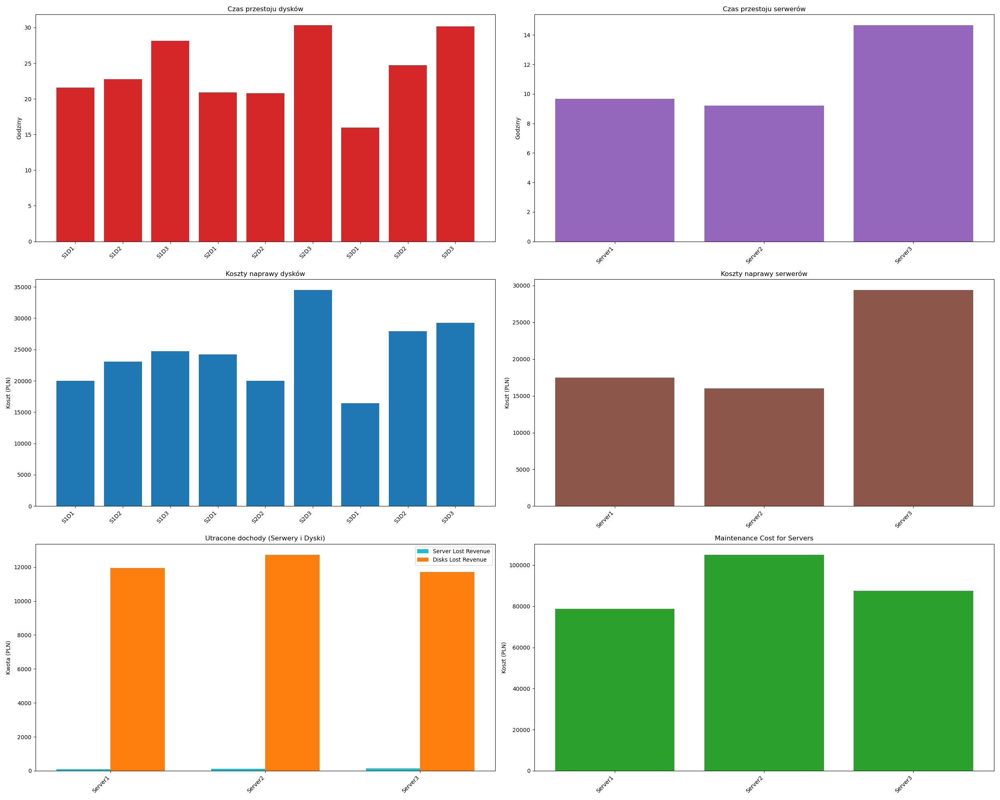

# Data Center Maintenance Simulator

## Overview
The **Data Center Maintenance Simulator** is a Python-based tool designed to analyze and compare the cost efficiency of various maintenance strategies for data center infrastructure, including servers and storage disks. By leveraging advanced statistical modeling and data visualization, the simulator helps users understand the impact of different maintenance policies on operational costs and system reliability.

## ✨ Features

- **Advanced Statistical Modeling:**
  - Simulates various maintenance strategies such as preventive, corrective, and predictive maintenance.
  - Computes cost efficiency based on failure rates, repair costs, and inspection intervals.
  - Uses statistical distributions to model hardware failures.

- **Visualization and Reporting:**
  - Generates CSV reports detailing maintenance efficiency and cost outcomes.
  - Produces graphical representations of simulation results for better insight.
  - Supports comparative analysis of different maintenance strategies.

- **Configurable Parameters:**
  - Fully customizable JSON-based configuration for maintenance strategies.
  - Adjustable parameters for failure rates, repair costs, and inspection frequencies.

## 🚀 Getting Started

### Prerequisites
Ensure you have Python installed (recommended version: 3.8+). Install the required dependencies using:

```bash
pip install -r requirements.txt
```

### Configuration

The simulator relies on a JSON configuration file (`config.json`) to define key simulation parameters, including:

- **`maintenance_strategy`**: The type of maintenance applied (e.g., "preventive", "corrective").
- **`failure_rate`**: Probability of component failure over time.
- **`repair_cost`**: The cost incurred for repairing a failed component.
- **`inspection_interval`**: The interval at which preventive maintenance inspections occur.

Example configuration:

```json
{
  "maintenance_strategy": "preventive",
  "failure_rate": 0.02,
  "repair_cost": 500,
  "inspection_interval": 30
}
```

### Running the Simulator

To execute the simulation, run the following command:

```bash
python simulation.py
```

Upon execution, the simulator will process the defined maintenance strategy and generate output files with the analysis results.

## 📊 Output
The simulator produces several output files:

- **`results_disks.csv`**: Contains simulation data for disk maintenance strategies.
- **`results_servers.csv`**: Contains simulation data for server maintenance strategies.
- **`servers_disks_results.png`**: A graphical representation of maintenance cost efficiency and system reliability.

## 📈 Sample Results

The following is a sample visualization generated by the simulator, illustrating the comparison of different maintenance strategies:



## 🛠 Simulation Methodology

The simulator follows a structured approach to evaluate maintenance strategies:

1. **Failure Modeling:**
   - Uses statistical models (e.g., exponential distribution) to simulate hardware failure events.
   - Generates random failure times based on predefined failure rates.

2. **Cost Analysis:**
   - Calculates total maintenance costs, including repair and preventive maintenance expenses.
   - Compares cost efficiency between preventive and corrective maintenance strategies.

3. **Simulation Execution:**
   - Runs multiple iterations of the simulation for statistically significant results.
   - Stores results in CSV files and generates visual reports for easier interpretation.

## 🔧 Future Improvements

- Support for additional failure models (e.g., Weibull distribution for more accurate failure rate estimation).
- Implementation of machine learning techniques for predictive maintenance optimization.
- Enhancements in reporting and visualization tools for deeper analysis.

## 🤝 Developer

- **Oleksandr Radionenko**

For inquiries or contributions, please feel free to reach out.

